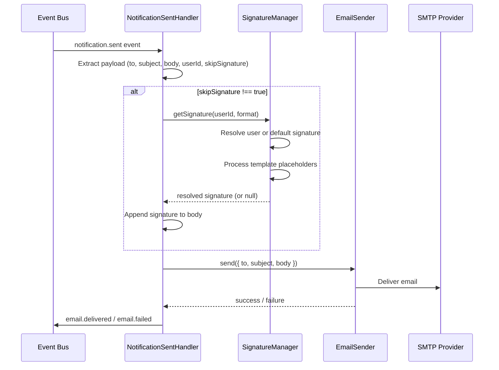

# Design Document — Email Signature

## Change Type

🟢 **Feature Spec** — new capability requiring detailed planning

## Overview

This design adds email signature support to the email-service. The feature introduces a new `SignatureManager` component responsible for storing, retrieving, and rendering signatures (including template placeholder resolution). The existing `EmailSender` is modified to append the resolved signature to the email body before SMTP delivery.

The design follows the existing event-driven architecture of the email-service. No new REST APIs or events are introduced — the signature logic is internal to the email delivery flow, triggered by the existing `notification.sent` event.

### Referenced Documents

- Service Spec: `system-sandbox/services/email-service/docs/specs/service-spec.md`
- Architecture: `system-sandbox/services/email-service/docs/architecture.md`
- Feature — Email Delivery: `system-sandbox/services/email-service/docs/specs/features/email-delivery.md`
- Requirements: `.kiro/specs/email-signature/requirements.md`

## Architecture

### Modified Email Delivery Flowww

The signature feature inserts itself between step 2 (extract payload) and step 3 (send via SMTP) of the existing email delivery flow.



### Affected Services

| Service | Change Type | Description |
|---|---|---|
| email-service | Modified + New code | New `SignatureManager`, modified `EmailSender` and `NotificationSentHandler` |
| notification-service | No change | Already sends `notification.sent` with `userId` in payload |
| audit-service | No change | Already consumes `email.delivered` / `email.failed` |

## Components and Interfaces

### 🆕 SignatureManager — `src/services/signatureManager.js`

Responsible for signature CRUD, storage, template processing, and retrieval logic.

```javascript
class SignatureManager {
  /**
   * 🆕 Save or update a signature.
   * @param {object} params
   * @param {string|null} params.userId - null for default (org-level) signature
   * @param {string} params.textContent - plain text signature
   * @param {string} params.htmlContent - HTML signature
   * @param {boolean} params.isTemplate - whether the signature contains {{placeholders}}
   * @returns {object} saved signature record
   * @throws {Error} if both textContent and htmlContent are empty
   */
  async saveSignature({ userId, textContent, htmlContent, isTemplate }) {}

  /**
   * 🆕 Retrieve the applicable signature for a user.
   * Returns user signature if it exists, otherwise the default signature.
   * @param {string} userId
   * @param {'text'|'html'} format - which format to return
   * @param {object} userData - user data for template placeholder resolution
   * @returns {string|null} resolved signature content, or null if none exists
   */
  async getSignature(userId, format, userData) {}

  /**
   * 🆕 Delete a signature.
   * @param {string|null} userId - null to delete the default signature
   */
  async deleteSignature(userId) {}

  /**
   * 🆕 Process template placeholders in a signature string.
   * Replaces {{field_name}} with values from userData.
   * Removes placeholders where data is missing.
   * @param {string} template - signature content with placeholders
   * @param {object} userData - { fullName, role, phone, email, companyName }
   * @returns {string} processed signature
   */
  processTemplate(template, userData) {}

  /**
   * 🆕 Validate signature content.
   * @param {string} textContent
   * @param {string} htmlContent
   * @returns {boolean}
   */
  validateSignature(textContent, htmlContent) {}
}
```

### ✏️ EmailSender — `src/services/emailSender.js` (Existing, modified)

Modified to accept and append a signature to the email body.

```javascript
class EmailSender {
  /**
   * ✏️ Modified: now accepts optional signature parameter.
   * @param {object} params
   * @param {string} params.to
   * @param {string} params.subject
   * @param {string} params.body
   * @param {string|null} params.signature - resolved signature to append
   * @param {'text'|'html'} params.format - email body format
   */
  async send({ to, subject, body, signature, format }) {}

  /**
   * 🆕 Append signature to email body with a visual separator.
   * @param {string} body - original email body
   * @param {string} signature - resolved signature
   * @param {'text'|'html'} format - determines separator style
   * @returns {string} body with signature appended
   */
  appendSignature(body, signature, format) {}
}
```

### ✏️ NotificationSentHandler — `src/handlers/notificationSentHandler.js` (Existing, modified)

Modified to orchestrate signature retrieval and pass it to `EmailSender`.

```javascript
module.exports = {
  /**
   * ✏️ Modified: now checks skipSignature flag and retrieves signature.
   */
  async handle(event) {
    // 1. Extract payload including userId, skipSignature
    // 2. If skipSignature !== true, call signatureManager.getSignature()
    // 3. Pass signature to emailSender.send()
    // 4. Publish email.delivered or email.failed
  },
};
```

### ✅ EventPublisher — `src/events/publisher.js` (Existing, unchanged)

No changes needed. Continues to publish `email.delivered` and `email.failed`.

## Data Models

### Signature Record

```javascript
{
  id: 'uuid',                    // unique signature ID
  userId: 'user-123' | null,    // null = organization default signature
  textContent: 'string',         // plain text version of the signature
  htmlContent: 'string',         // HTML version of the signature
  isTemplate: true | false,      // whether content contains {{placeholders}}
  createdAt: 'ISO-8601',
  updatedAt: 'ISO-8601'
}
```

### Signature Audit Log Entry

```javascript
{
  signatureId: 'uuid',
  userId: 'user-123' | null,
  previousTextContent: 'string',
  previousHtmlContent: 'string',
  changedAt: 'ISO-8601',
  changeType: 'update' | 'delete'
}
```

### Extended Event Payload — `notification.sent`

The existing `notification.sent` event payload is extended with optional fields:

```javascript
{
  notificationId: 'uuid',
  userId: 'user-123',
  channel: 'email',
  templateId: 'template-id',
  payload: {
    to: 'recipient@example.com',
    subject: 'Email subject',
    body: 'Email body content',
    format: 'html' | 'text',       // 🆕 indicates body format
    skipSignature: true | false,    // 🆕 opt-out flag
    userData: {                     // 🆕 user data for template resolution
      fullName: 'string',
      role: 'string',
      phone: 'string',
      email: 'string',
      companyName: 'string'
    }
  }
}
```

### Template Placeholder Format

Placeholders use the `{{field_name}}` syntax. Supported fields:

| Placeholder | Source Field | Example |
|---|---|---|
| `{{fullName}}` | `userData.fullName` | Jane Doe |
| `{{role}}` | `userData.role` | Software Engineer |
| `{{phone}}` | `userData.phone` | +1-555-0100 |
| `{{email}}` | `userData.email` | jane@example.com |
| `{{companyName}}` | `userData.companyName` | Acme Corp |

### Separator Formats

| Format | Separator |
|---|---|
| Plain text | `\n--\n` |
| HTML | `<hr style="border:none;border-top:1px solid #ccc;margin:16px 0;">` |


## Correctness Properties

*A property is a characteristic or behavior that should hold true across all valid executions of a system — essentially, a formal statement about what the system should do. Properties serve as the bridge between human-readable specifications and machine-verifiable correctness guarantees.*

### Property 1: Signature storage round-trip

*For any* valid signature (with non-empty text and HTML content) saved for any userId (including null for default), retrieving the signature for that userId should return the exact same textContent and htmlContent that were saved.

**Validates: Requirements 1.1, 1.3**

### Property 2: Single default signature invariant

*For any* sequence of default signature saves (userId=null), the system should store exactly one default signature at any point in time — saving a new default replaces the previous one.

**Validates: Requirements 1.2**

### Property 3: Empty signature validation

*For any* signature where both textContent and htmlContent are empty or consist entirely of whitespace, the `saveSignature` operation should reject the input and not persist it.

**Validates: Requirements 1.4**

### Property 4: Audit log on signature update

*For any* existing signature that is updated with new content, the audit log should contain an entry with the previous textContent and htmlContent values, the signatureId, and a timestamp.

**Validates: Requirements 1.5**

### Property 5: Signature append with correct format and separator

*For any* email body, resolved signature, and format (text or html), the `appendSignature` function should produce output that contains the original body, followed by the format-appropriate separator (`\n--\n` for text, `<hr ...>` for HTML), followed by the signature content matching the requested format.

**Validates: Requirements 2.1, 2.4, 2.5, 2.6**

### Property 6: Signature resolution precedence

*For any* userId, if a User_Signature exists for that userId, `getSignature` should return the User_Signature. If no User_Signature exists but a Default_Signature exists, `getSignature` should return the Default_Signature.

**Validates: Requirements 2.2, 2.3**

### Property 7: Template placeholder processing

*For any* signature template containing `{{field_name}}` placeholders and any userData object, after processing: all placeholders whose corresponding field exists in userData should be replaced with the field value, and all placeholders whose corresponding field is missing should be removed (no raw `{{...}}` strings remain in the output).

**Validates: Requirements 3.1, 3.2, 3.3**

### Property 8: skipSignature flag controls signature inclusion

*For any* email event, the signature is appended to the email body if and only if `skipSignature` is not `true`. When `skipSignature` is `true`, the sent email body should equal the original body exactly.

**Validates: Requirements 4.1, 4.2, 4.3**

### Property 9: Graceful degradation on retrieval failure

*For any* email where signature retrieval throws an error, the email should still be sent successfully with the original body unchanged (no signature appended), and a warning should be logged.

**Validates: Requirements 5.1**

### Property 10: Graceful degradation on template processing failure

*For any* signature template where `processTemplate` throws an error, the `getSignature` function should return the raw unprocessed signature content (with placeholders intact) rather than failing, and an error should be logged.

**Validates: Requirements 5.3**

## Error Handling

| Scenario | Behavior | Logging |
|---|---|---|
| Signature retrieval fails (DB error, timeout) | Email sent without signature | Warning: `"Signature retrieval failed for userId={userId}, sending without signature"` |
| No default and no user signature exist | Email sent without signature | Info: `"No signature found for userId={userId}"` |
| Template placeholder processing fails | Return raw signature without replacements | Error: `"Template processing failed for signatureId={id}: {error}"` |
| Signature validation fails (empty content) | Reject save operation, throw validation error | Warning: `"Signature validation failed: content is empty"` |
| SMTP failure (existing behavior) | Publish `email.failed` event | Error: existing logging unchanged |

All logging follows structured JSON format with `correlationId` as per system conventions.

Key principle: **signature issues must never prevent email delivery**. The signature feature is additive — if anything goes wrong, the email is sent without a signature.

## Testing Strategy

### Unit Tests

Unit tests cover specific examples, edge cases, and integration points:

- `SignatureManager.validateSignature` rejects empty string, whitespace-only, and null inputs
- `SignatureManager.processTemplate` correctly replaces `{{fullName}}`, `{{role}}`, `{{phone}}`, `{{email}}`, `{{companyName}}` with provided values (validates Requirement 3.4)
- `EmailSender.appendSignature` produces correct output for a known body + signature pair
- `NotificationSentHandler.handle` sends email without signature when no signatures exist (edge case for Requirement 5.2)
- `NotificationSentHandler.handle` sends email without signature when `skipSignature: true` and no signature retrieval is attempted
- Audit log entry is created with correct `changeType` on delete

### Property-Based Tests

Property-based tests validate universal correctness properties using generated inputs. Use [fast-check](https://github.com/dubzzz/fast-check) as the property-based testing library (Node.js / JavaScript).

Each property test must:
- Run a minimum of **100 iterations**
- Reference the design property with a tag comment

| Test | Property | Tag |
|---|---|---|
| Storage round-trip | Property 1 | `Feature: email-signature, Property 1: Signature storage round-trip` |
| Single default invariant | Property 2 | `Feature: email-signature, Property 2: Single default signature invariant` |
| Empty validation | Property 3 | `Feature: email-signature, Property 3: Empty signature validation` |
| Audit log on update | Property 4 | `Feature: email-signature, Property 4: Audit log on signature update` |
| Append with format/separator | Property 5 | `Feature: email-signature, Property 5: Signature append with correct format and separator` |
| Resolution precedence | Property 6 | `Feature: email-signature, Property 6: Signature resolution precedence` |
| Template placeholder processing | Property 7 | `Feature: email-signature, Property 7: Template placeholder processing` |
| skipSignature flag | Property 8 | `Feature: email-signature, Property 8: skipSignature flag controls signature inclusion` |
| Retrieval failure graceful | Property 9 | `Feature: email-signature, Property 9: Graceful degradation on retrieval failure` |
| Template failure graceful | Property 10 | `Feature: email-signature, Property 10: Graceful degradation on template processing failure` |

### Test File Structure

```
src/
├── services/
│   ├── __tests__/
│   │   ├── signatureManager.test.js        # Unit + property tests for SignatureManager
│   │   └── emailSender.test.js             # Unit + property tests for EmailSender
├── handlers/
│   ├── __tests__/
│   │   └── notificationSentHandler.test.js # Unit + property tests for handler
```
